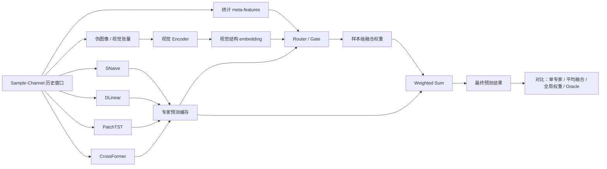
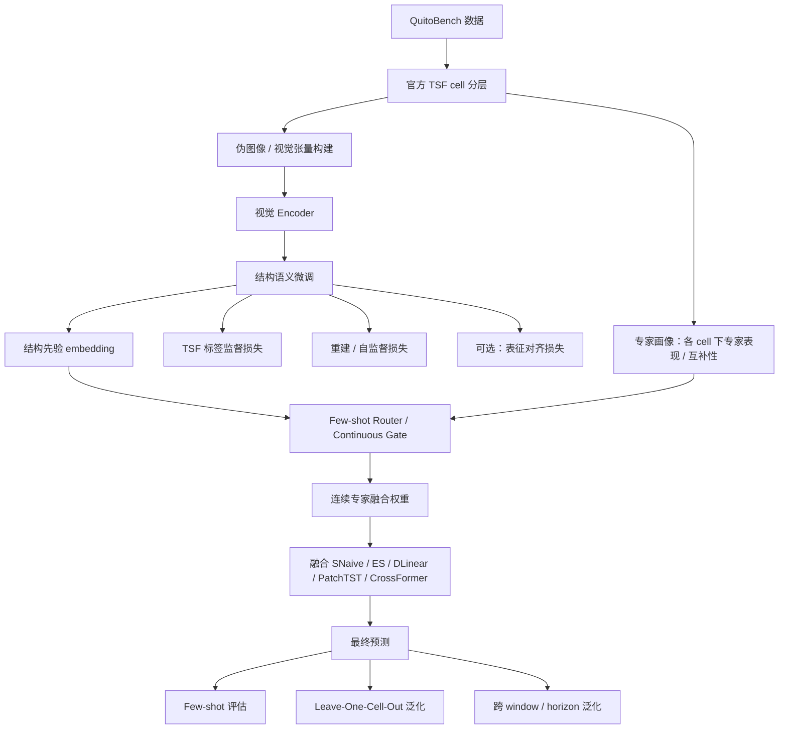

# 最近实验计划与当前问题汇报

## 1. 实验方案

### 1.1 课题目标

本课题当前的核心目标是：

- 通过通道独立的伪图像 / 视觉张量表示，学习 sample-channel 历史窗口中的时序结构先验，并验证该先验能否跨窗口长度、预测 horizon 和数据源迁移到异构时序专家的连续自适应融合任务。

#### 1.1.1 视觉模块不是直接预测器

当前的视觉模块并不是要直接替代 PatchTST、CrossFormer 或 DLinear 这类时序预测模型，而是想回答：

- 对于一个给定的历史窗口，能否通过伪图像 / 视觉张量表达它的结构信息；
- 这些结构信息包括趋势、周期性、频谱集中度、可预测性、局部突变等；
- 然后用这种结构表示去指导后续的专家选择或连续融合。

因此，视觉模块更接近一个**结构先验提取器**，而不是直接输出未来值的预测器。

#### 1.1.2 建模粒度是 sample-channel 历史窗口

当前采用的是 **sample-channel** 粒度，而不是 item 级全序列粒度。原因是后续路由和融合真正面对的是一个个历史窗口，而不是整条完整时间序列。

视觉模块的输入单位应该是：

- 单个样本；
- 单个通道；
- history-only 的历史窗口。

也就是说，视觉模块只读取历史窗口，不读取 target，不使用未来信息。

#### 1.1.3 最终任务是异构专家的连续自适应融合

最终验证任务不是简单分类，而是：

- 给定一个 sample-channel 历史窗口；
- 估计当前各个专家对这个窗口的适用性；
- 输出连续融合权重；
- 对多个专家预测结果加权求和；
- 得到比单专家、平均融合或全局固定权重更稳的预测结果。

因此，本课题的最终落点是：

> **视觉结构先验是否能迁移到“专家偏好 / 专家适配性”这个下游任务上。**

---

### 1.2 数据集：QuitoBench（支付宝开源 benchmark）

#### 1.2.1 选择动机

当前主实验数据集选用 **QuitoBench**，来源于 Alipay 生产系统中的应用流量序列。其上游是更大规模的 **QUITO** 语料，QuitoBench 则是在此基础上构建出的平衡化评测集。

相比传统的 ETT / Weather / Traffic / Electricity 等数据集，QuitoBench 有几个优势。

- **规模足够大**：benchmark 共有 **1290 个 item**，每个 item 有 **5 个 channel**，因此共有 **6450 条 item-channel 序列**。如果按 dense rolling window 切分，在多个 `history_len / pred_len` 设置下可以得到千万级别的窗口样本，规模上足以支撑专家训练、专家预测缓存和后续 router 训练。

- **train / validation / test 切分**：官方提供统一的时间切分点，将数据划分为 train / validation / test。

- **TSF regime 划分**：QuitoBench 不是按“领域”划分，而是按时间序列本身的统计结构属性来划分。具体而言，使用：

  - T：trend strength，趋势强度；
  - S：seasonality strength，季节性强度；
  - F：forecastability，可预测性。

  这三个维度共同组成 8 个 `trend × seasonality × forecastability` 的 TSF regime cell。这对本课题非常关键，因为后续需要分析：

  - 不同结构区域中，专家是否存在不同偏好；
  - 视觉结构表示是否在某些 TSF cell 上更有效；
  - 视觉先验是否具有跨结构泛化能力。

- **各个 TSF cell 近似均衡**：QuitoBench 构建时通过 stratified sampling，使 8 个 TSF cell 的 item 数比较均衡，避免传统 benchmark 中某一类简单结构样本占绝大多数的问题。这使得总体评估不至于被某个“主导类型”淹没，也更适合做结构分层分析。

#### 1.2.2 QuitoBench 的基本组成

当前采用的是 QuitoBench，关键统计如下：

- 总共 **1290 条 item**；
- 其中：
  - **773** 条来自 minute-level subset；
  - **517** 条来自 hour-level subset；
- 每条 item 有 **5 个 variate / channel**；
- 官方按 TSF regime 划分为 **8 个 cell**；
- 每个 cell 的比例大致均衡，约在 **10%–13%** 之间。

每个 item 的 TSF regime 大致是通过以下方式定义的：

1. 对每个 channel 计算：
   - trend strength；
   - seasonality strength；
   - forecastability；
2. 对 5 个 channel 的结果取平均；
3. 采用阈值 `tau = 0.4` 进行 high / low 二值化；
4. 得到 8 个 `T × S × F` cell。

这套设计的好处是，它抓的是**时间序列本身的结构属性**，而不是粗粒度领域标签，因此非常适合做“结构先验”研究。

#### 1.2.3 与常用数据集的对比

传统 TimeFuse 或 LTSF 相关工作常用的数据集包括：

- ETTh1 / ETTh2 / ETTm1 / ETTm2；
- Weather；
- Electricity；
- Traffic。

当前策略是：

- **QuitoBench 作为主实验场景**；
- ETT / Weather / Traffic / Electricity 作为后续外部泛化补充数据源。

---

### 1.3 细化方案：通用基础

这部分是路线 1 和路线 2 都要共享的基础模块。

#### 1.3.1 数据集准备：

下载数据、恢复官方 TSF cell 划分

#### 1.3.2 图像化方法设计：三视图结合

当前计划采用三种互补视图，把 1D 历史窗口映射成适合视觉 encoder 处理的伪图像 / 视觉张量。

##### 视图一：原始曲线图（plot / line raster）

作用：

- 保留整体趋势；
- 保留局部波动和异常点；
- 直观呈现时域结构。

##### 视图二：period reshape 2D

将一维序列按某个周期折叠成二维结构，例如：

- hour subset 可以按 24 点折叠；
- minute subset 可以按 144 点折叠。

作用：

- 强化周期结构；
- 让季节性在二维空间中显式出现；
- 有助于捕捉周期性错位、模式重复等现象。

##### 视图三：FFT / 频谱图

对历史窗口做 FFT 或 STFT，构建频谱图。

作用：

- 呈现主频；
- 表达能量集中度；
- 对应可预测性 / 谱熵等结构信息。

三类视图分别对应：

- 时域形态；
- 周期结构；
- 频域结构。

它们与 TSF 中的 T / S / F 三个维度有自然关联，因此是较合理的第一版设计。

#### 1.3.3 下游时序专家选择

当前准备选用的专家包括两类。

##### 简单专家

- **ES（Exponential Smoothing）**
- **SNaive（Seasonal Naive）**

它们主要承担：

- 统计基线；
- sanity check；
- 在高季节性样本上的候选强基线。

##### 深度学习专家

- **DLinear**
- **PatchTST**
- **CrossFormer**

选择原因：

1. 它们覆盖不同归纳偏置：
   - DLinear：分解 + 线性；
   - PatchTST：patch-based Transformer；
   - CrossFormer：跨时间 / 跨维度 Transformer。
2. 它们是 QuitoBench 论文中重点比较、且性能较优的模型。
3. 三者加上 SNaive / ES 后，专家池既有简单基线，也有较强深度模型，适合做异构融合。

后续如果要增强通用性，可以再考虑加入小规模时序基础模型，例如：

- Chronos；
- TimesFM；
- Moirai。

#### 1.3.4 时序特征缓存计算

为了后续路线使用，还需要离线计算一批轻量时序特征，作为：

- 路线 1 中 statistical router 的输入；
- 路线 1 中与视觉 router 对比的 baseline；
- 路线 2 中结构解释或辅助监督的信号。

这部分特征可以包括：

- mean / std / max / min；
- slope / trend proxy；
- autocorrelation / seasonal autocorrelation；
- dominant frequency；
- spectral entropy；
- amplitude / volatility；
- change rate / zero-crossing rate；
- missing ratio / flatness 等。

这些特征只从 **history window** 计算，不读取 target。

---

## 1.4 路线 1：基础实验

### 1.4.1 验证目标

路线 1 的目标是：

> 在**不使用 TSF 标签监督**的情况下，验证视觉 encoder 从伪图像 / 视觉张量中抽取的表示，是否比统计 meta-feature 或普通时序 encoder 更适合预测专家偏好，并最终提升样本级异构专家融合效果。

### 1.4.2 核心思想

路线 1 本质上参考 **TimeFuse**：

```text
输入窗口特征
-> 多专家预测缓存
-> 样本级融合权重
-> weighted sum
-> 与单专家 / 平均融合 / 全局权重对比
```

和 TimeFuse 的区别是：

- TimeFuse 主要用统计 meta-features；
- 这里重点测试**视觉结构 embedding**；
- 同时比较：
  - statistical router；
  - visual router；
  - visual + statistical router；
  - 普通时序 encoder router。

### 1.4.3 路线 1 示意图



### 1.4.4 具体实施方案

#### Step 1：训练专家

先选定若干专家，在 QuitoBench 上按照统一协议训练 / 测试：

- SNaive；
- ES；
- DLinear；
- PatchTST；
- CrossFormer。

使用官方配置、官方 split、官方 data pipeline，尽量保证专家结果可信。

#### Step 2：缓存 validation / test 样本上的预测

对 `vali/test` 样本重新跑预测，缓存：

- `y_true`；
- `pred_snaive`；
- `pred_dlinear`；
- `pred_patchtst`；
- `pred_crossformer`；
- 每个专家的误差；
- best expert id；
- soft oracle weight。

建议**用 validation set 训练 router，用 test set 评估**。这样可以避免直接用 train 上的 in-sample 误差训练 meta-model。

#### Step 3：训练 router

router 的输入可以有多种版本：

1. statistical features only；
2. visual embedding only；
3. visual + statistical features；
4. 普通时序 encoder embedding。

router 输出连续融合权重：

```text
w = softmax(g(x))
```

最终预测为：

```text
y_hat = Σ w_i * pred_i
```

#### Step 4：测试与对比

路线 1 中，最终需要比较的对象包括：

- best fixed expert；
- uniform ensemble；
- global weighted ensemble；
- statistical router；
- visual router；
- visual + statistical router；
- oracle upper bound。

### 1.4.5 关键指标

预测指标：

- MAE；
- MSE；
- normalized MAE；
- normalized MSE。

路由指标：

- oracle gap；
- top-1 expert accuracy；
- soft target KL；
- routing entropy；
- expert utilization entropy。

---

## 1.5 路线 2：结构解释与迁移验证路线

### 1.5.1 验证目标

路线 2 的目标是：

> 在 QuitoBench 的 **TSF 结构分层**下，验证不同专家在 trend / seasonality / forecastability 组合 cell 中是否存在可测的偏好和互补性；经过 TSF 结构语义微调的视觉编码器，是否能从 GPU 端内生伪图像张量中提取更有结构语义的表示，并在 few-shot 条件下生成更有效的连续专家融合权重。

路线 2 回答的问题比路线 1 更深：

- 不同 TSF cell 中专家是否有稳定偏好？
- 视觉 embedding 是否真的捕捉了 TSF 结构？
- 这种结构先验能否 few-shot 适配？
- 能否 Leave-One-Cell-Out 泛化？
- 能否跨 history length / prediction horizon 迁移？

### 1.5.2 四个阶段

#### 阶段 A：专家画像

先不训练视觉 encoder，先回答：

- 在不同 TSF cell 中；
- SNaive / ES / DLinear / PatchTST / CrossFormer；
- 谁更强？
- 是否存在稳定互补性？

如果不同专家在不同 cell / 不同 horizon 下确实存在偏好，路线 2 才有意义。

#### 阶段 B：视觉结构语义微调

这里建议从简单到复杂。

第一版先做：

- `TSF 标签监督损失 L_tsf`；
- `融合任务损失 L_route`。

然后再考虑是否引入：

- 重建损失 `L_recon`；
- 与时序基础模型表征对齐损失 `L_align`。

不建议第一版就把三种损失一起上。先证明 **TSF-aware 的视觉 embedding** 是否比纯 visual embedding 更有利于 router。

#### 阶段 C：few-shot router

在新 cell / 新 horizon / 新数据源上，只提供少量样本，让 router 做轻量适配。few-shot 设置可包括：

- 1-shot；
- 5-shot；
- 10-shot；
- 50-shot。

先比较：

- 不适配；
- 只调最后一层；
- 调完整 router。

暂时不建议一开始就动专家本体。

#### 阶段 D：Leave-One-Cell-Out 泛化

训练时使用 7 个 cell，留 1 个 cell 完全不参与训练，在该 cell 上测试。这个实验最能支撑“结构先验泛化”的说法，但难度也最高，因此适合作为路线 2 的后半段实验。

### 1.5.3 路线 2 示意图



### 1.5.4 推荐实施方案

#### 1）专家画像

先做一个 `TSF cell × expert` 的结果矩阵，统计：

- 每个 cell 中各专家的 MAE / MSE；
- 每个 cell 的 best expert；
- oracle gap；
- cell 内专家互补性；
- 不同 history length 和 horizon 下专家偏好是否变化。

这一部分是路线 2 后续所有结论的前提。

#### 2）视觉结构语义微调

建议采用一种“主 + 辅”的训练目标：

```text
L = L_route + λ1 * L_tsf + λ2 * L_recon + λ3 * L_align
```

但 MVP 阶段建议先简化为：

```text
L = L_route + λ1 * L_tsf
```

也就是说，先看**带 TSF 结构约束**的视觉表示，是否比纯视觉表示更能帮助后续融合。

#### 3）Few-shot router

场景设计可以是：

- 在某个新 cell 上仅给少量样本；
- 在某个新 horizon 上仅给少量样本；
- 在 hour / min 子集之间做少量迁移适配；
- 在外部数据集上少量适配。

重点观察：

- 视觉先验是否能减少适配样本需求；
- 视觉先验是否比统计 meta-feature 更适合 few-shot 迁移。

#### 4）Leave-One-Cell-Out 泛化

这个实验最能突出“结构先验”的意义。如果训练时完全不见某个结构 cell，但测试时仍能比较稳定地做出有效融合，说明视觉表示学到的不是单纯记忆，而是更抽象的结构归纳。

### 1.5.5 路线 2 的意义

路线 2 回答的是更深一层的问题：

> 视觉结构先验不仅是否有效，而且**为什么有效、在哪些结构条件下有效、能否在新结构上泛化**。


---

# 2. 目前完成的内容

## 2.1 数据集

### 2.1.1 已完成内容

目前已经完成或基本确认：

- QuitoBench 规模足够大，可通过 dense sliding window 切分出千万级样本；
- benchmark 包含 hour / min 两个 subset；
- 每个 item 有 5 个 channel；
- benchmark 总共有 1290 个 item；
- 已通过历史 commit、论文细节和数据工具，反推官方 TSF cluster codebook。

### 2.1.2 官方 TSF cell 反推情况

官方公开数据集最新版本中没有直接暴露 TSF cluster 细节，代码仓库中也没有特别直接的 cluster 映射代码。  但通过论文和历史 revision，可以较高置信度地恢复 cluster 到 8 个 TSF cell 的映射。

当前高置信的 codebook 是：

| cluster code | TSF cell |
| ---: | --- |
| 0 | highT_highS_highF |
| 2 | highT_highS_lowF |
| 6 | highT_lowS_highF |
| 8 | highT_lowS_lowF |
| 18 | lowT_highS_highF |
| 20 | lowT_highS_lowF |
| 24 | lowT_lowS_highF |
| 26 | lowT_lowS_lowF |

另外，参考论文中 regime 构造方式，我尝试根据以下逻辑本地重推 cell，目前发现：

- forecastability 维度匹配较好；
- trend / seasonality 维度存在若干不一致。

因此当前结论是：

> **官方 TSF cell 可以作为路线 2 的主分层标签；本地重构的 STL / proxy 结果更适合作为辅助解释，而不应直接替代官方标签。**

---

## 2.2 图像化方法设计

已完成第一版设计，采用三视图：

1. plot / line raster；
2. period reshape 2D；
3. FFT / 频谱图。

这三视图分别对应时域、周期和频域结构，是目前认为较合理的视觉化方案。后续将继续比较：

- 单视图效果；
- 多视图拼接效果；
- visual only；
- visual + statistical feature。

---

## 2.3 下游时序专家选择

当前已经明确专家池：

- 简单专家：ES / SNaive；
- 深度专家：DLinear / PatchTST / CrossFormer。

选择依据：

1. 模型归纳偏置不同；
2. QuitoBench 论文中有完整报告；
3. 兼顾简单统计模型和深度模型，适合做异构融合分析。

---

## 2.4 时序特征计算

sample-channel 级别的轻量统计特征计算代码已经完成。后续用途包括：

- 作为 statistical router 的输入；
- 作为 visual router 的 baseline 对照；
- 作为路线 2 中的辅助解释 / 辅助监督信号。

---

# 3. 目前存在的问题

## 3.1 当前最大卡点：QuitoBench 上专家表现反常

目前最主要的问题在于：

> 在采用官方环境、官方封装代码和官方脚本的情况下，反复训练测试 SNaive / DLinear / PatchTST / CrossFormer，出现了明显反常的性能倒挂现象。

按照论文结果以及我们在其他数据集上的经验，一般预期是：

```text
CrossFormer > PatchTST > DLinear > SNaive
```

但目前多次实验观察到的大致排序更接近：

```text
SNaive > DLinear > CrossFormer > PatchTST
```

具体表现包括：

- SNaive 在整体上表现 surprisingly 强；
- DLinear 有一定补充价值；
- CrossFormer 和 PatchTST 没有体现出预期优势；
- PatchTST 甚至在部分设置下出现发散迹象。

这和论文中报告的整体趋势明显相反。

---

## 3.2 对 QuitoBench 论文协议的再确认

我重新阅读了 QuitoBench 论文中关于训练测试协议的描述，确认以下几点：

1. 深度模型是在 QuitoBench 的 train / validation / test split 上训练测试的；
2. 流程是：validation 调参 → 选定超参数后重新训练 → 以 validation best checkpoint 在 test 上评估；
3. 训练是多 item 混合训练，不是把每个 item / channel 拆开单独训练；
4. 测试采用 dense rolling-window evaluation，而不是简单的 sparse 窗口抽样。

---

## 3.3 后续影响

后续路由模块本质上建立在**专家预测缓存**之上。如果专家结果本身不可信，那么后续 router 学到的“专家偏好”也会不可信。

---

## 3.4 其他想法

### 3.4.1 快速推进的补救方案：回退到 TimeFuse

一种保守方案是回退到 TimeFuse 常用的数据集和流程，比如：

- ETTh1 / ETTh2 / ETTm1 / ETTm2；
- Weather；
- Traffic；
- Electricity。

这样可以快速打通：

- 专家训练；
- 专家预测缓存；
- router 训练；
- 融合评估。

但这个方案也有明显问题：

1. 数据集结构单一；
2. 没有官方 TSF cell；
3. 对路线 2 的结构解释和 few-shot / Leave-One-Cell-Out 实验支持不足；
4. 传统数据集可能存在异常值、结构分布不均衡等问题。

---

### 3.4.2 关于整体架构合理性的思考

目前系统确实有一定“分裂感”：

- 前面是视觉路由模块；
- 后面是真正做预测的时序专家；
- 两者不是像 MoE 一样联合训练，而是相对分离。

这带来两个担忧。

#### 担忧一：如果专家本身很弱，router 再准确也没用

即使 router 能精确判断当前应该分给哪个专家或哪几个专家，但最终预测效果仍然主要依赖专家本身。如果专家本身预测能力不足，那么最终性能上限也不会太高。

#### 担忧二：面向新数据源时，专家往往仍需重新训练

当前选用的专家基本还是监督式深度模型。面对新的垂直领域数据时，这些专家大概率仍然需要重新训练或微调。如果专家要重训，router 也要重新训练，那么系统的“通用性”会被质疑。

---

### 3.4.3 补充性思路

#### 思路 A：加入小规模时序基础模型

可以考虑把 Chronos / TimesFM / Moirai 这类模型也纳入专家池，形成：

- 统计基线；
- 本地训练专家；
- 预训练基础模型。

这样新数据源上即使本地专家还未完全训练好，也可以依靠 foundation model 作为补充。缺点是系统更庞大，推理代价更高，实际收益未知。

#### 思路 B：视觉模块向预测端输出更多信息

可以不是只输出融合权重，而是输出某种下游辅助信息。最安全的方式是做一个**预测残差修正**：

```text
y_hat = Σ w_i * pred_i + delta(x)
```

其中 `delta(x)` 来自视觉 embedding。  
但前期试验也表明 residual 的帮助有限。

#### 思路 C：半耦合设计

更稳妥的升级是：

- 冻结专家主体；
- 训练轻量 adapter；
- router 和 adapter 一起通过最终 forecasting loss 训练。

这样专家和 router 不再完全割裂，但训练成本仍然低于端到端 MoE。

---

# 4. 希望讨论的问题

1. 当前是否应该继续以 QuitoBench 作为主数据集，还是先回退到 TimeFuse 数据集打通闭环？
2. 如果 QuitoBench 上专家复现持续异常，是否应优先做专家协议审计，而不是继续视觉路由？
3. 路线 2 是否应先从 expert profiling 和 TSF cell 分层开始，而不是立即做复杂的视觉结构语义微调？
4. 是否有必要引入时序基础模型作为专家，增强系统通用性？
5. 当前系统是否应保持 frozen expert + router 的外部融合形式，还是提前设计 residual correction / routed adapter 这样的半耦合版本？
